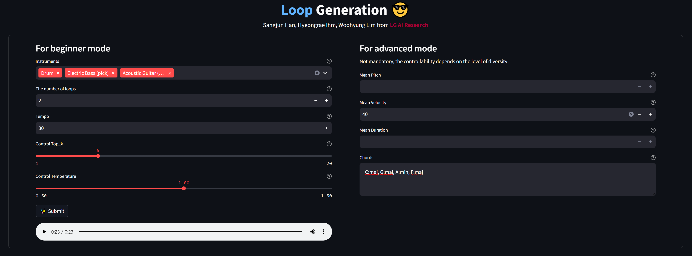

# The Interface of Loop Generation

This repository is the implementation of "The Interface of Symbolic Music Loop Generation Conditioned on Musical Metadata".

## Getting Started

### Environments

* Python 3.10.12
* Ubuntu 20.04.5 LTS
* CUDA version: 11.8/12.0
* NVIDIA driver version: 520.xx.xx/525.xx.xx
* Read [requirements.txt](/requirements.txt) for other Python libraries

## Demo Inference
http://52.78.242.81:7002/

## Appreciation
I have learned a lot and reused available codes from [dvruette FIGARO](https://github.com/dvruette/figaro) for the data preprocess, [lucidrains vit-pytorch](https://github.com/lucidrains/vit-pytorch) for the basic structure of Transformer, and [xformers](https://github.com/facebookresearch/xformers) for advanced techniques.

## References
Sangjun Han, Hyeongrae Ihm, Woohyung Lim (LG AI Research), "The Interface of Symbolic Music Loop Generation Conditioned on Musical Metadata"